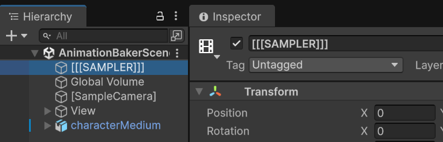
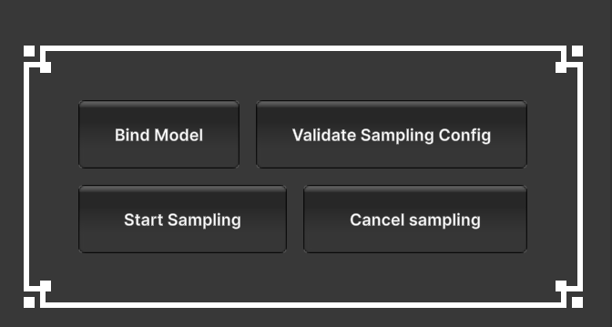
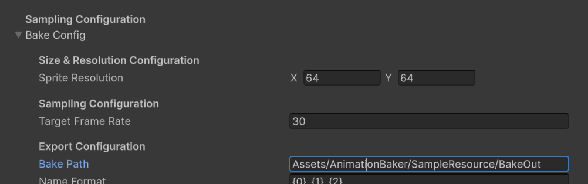

# Pixel Animation Baker Documentation

---

If you're viewing this on PDF,  you can go to <https://malish-studio.github.io/MalishStuWebsite/index.html> for latest update

---

### Table of Content

<!-- toc -->

---

## **1/Getting started**

**0.**  Setup

  **URP Render Pipeline Asset must allow Alpha Processing**. 
  > Go to Edit > Project Settings > Quality, in the active quality tier, open **Render Pipeline Asset** in the inspector. In the **Post Processing** section of the asset, tick enable **Alpha Processing**

**1.**  Open scene **AnimationBakerScene**

   > [!TIP]
   > You may also turn off the No Camera Rendering warning, and also adjust the Game View size to your liking
   >
   >>
   
**2.** Drag **your model** onto the scene, adjust your model’s transform, and **\[SampleCamera]**’s FOV/transform to your liking

   > [!TIP]
   > In the scene view, locate the [SampleCamera] object. There should be a ground plane and a background plane to help you position your model.
   >> 
   >> When you change the Camera's aspect or size, you can navigate to the AlignPlane component to align the planes correctly. For perspective camera, there's currently no support to align ground plane 
   >>>
   
**3.** Open the **\[\[\[SAMPLER]]]** object and drag your model’s reference into **AnimationSampleRequester**’s **Root Model Transform** field and the AnimationClip you want to sample into **Sampler Clips** field

   >>
 
**4.** **Enter Play Mode** and tap button **Start Sampling on AnimationSampleRequester** component
   >>

**5.** Navigate to the **Bake Path** to see your exported spritesheet!
   >> 
   
   > [!TIP]
   > After you're done baking, you can view the baked animation data to the right hand side, and buttons to navigate the list of baked animations to the left hand side.
   >
   > You can also click on the animation data to copy the spritesheet name to your clipboard.
   >>> 

> [!NOTE]
> For **Capturing the Photo image** of your object, you can skip the Animation references. 
> And tap the **Capture Object** button instead of Start Sampling button
 
 
### **1.1/Setup for more advanced usage**

 1. **Create a new RendererData** 

   It's generally a good practice to create a separate RendererData for the sampling scene vs your normal usage RendererData.
   To do this, go to the active **RenderPipelineAsset**, duplicate a **RendererData**, **rename** it and **add** the newly created RendererData to the Renderer list

   >

   Next, you can go to [SampleCamera]'s Camera component, and change the **Renderer** to your newly created Renderer. This camera will now render using this Renderer, and you can add further effects to this Renderer to your likings.
   
   >

---

## **2/Configuration**

 ### 2.0/ Unity Compability Feature Config |
By default, the tool should be compatible with various Unity built-in features, such as post-processing volume, Renderer Features, Renderer Layer, Line Renderer, etc.

Please send me an email if you have a problem using a Unity built-in features with the tool.

> [!TIP]
> Feel free to add lighting and Post-Processing Volume to Bake Scene!

> **Scene Post-processing volume**
> 

> **URP Renderer feature**
> 
> See [here](documentation.md#4example-scenes) for example

 ### 2.1/Model\&Animation Config

  #### 2.1.1/ Root Model Transform | 
 Reference to the model to be sampled

  #### 2.1.2/ Sampler Clips | 
 The list of AnimationClips to be sampled

   > [!CAUTION]
   > Animator component **must** use non-legacy AnimationClips
   > 
   > Animation component **must** use legacy AnimationClips

  #### 2.1.3/ Collect Animations on Bind | 
 if enabled, everytime the model is bound, it will also collect all the AnimationClips referenced by the Animation/Animator component and add them to Sampler Clips. The model is bound in these three occasions if a model reference is assigned (a) on Awake, (b) when validate config, and (c) when user clicks the Bind Model button 

 ### 2.2/Bake Config

  #### 2.2.1/Sprite Resolution

The size of exported sprites. Be cautious when increasing the size of sprite, as this will increase the exported sprite sheet proportionally.

  #### 2.2.2/Target Framerate

The framerate of the exported spritesheet animation. Be cautious when increasing the target framerate, as this will increase the exported sprite sheet proportionally.

When using mode Wait Frame, the highframe rate is not guaranteed to be stable. The usual safe threshold is to be equal or below **60fps**, depending on the machine.

  #### 2.2.3/Save Path

Save path is relative to the Project directory

  #### 2.2.4/Exported Name Format

You can use string format to name the exported files. The formatted argument is as below:

0 - Model Root transform name

1 - Sampling AnimationClip name

2 - Sprite Resolution

3 - Target Framerate

  #### 2.2.5/Exported Texture Format

The texture format to use for the exported spritesheet

 ### 2.3/Sampling Resource Template

  #### 2.3.1/Sampling RenderTexture Configs

Any subsequent RenderTextures created for sampling purpose will copy the **Color Fomat**, **Depth Stencil Format**, and **Filter Mode** of this original SampleRenderTexture.

You can adjust theses config to better suit your usage <https://docs.unity3d.com/6000.4/Documentation/ScriptReference/Experimental.Rendering.GraphicsFormat.html>

---

 ### 2.4/Frame Seeking Mode
This option defines how the sample find the animation frame to blit

**Mode Wait Frame** |

In this mode, animation is played **synchronously**. 
Each update, the sampler increments the timer by deltaTime, and checks if it should blit the current frame based on the timer, if yes perform blit and reset the timer

> [!IMPORTANT]
>  Sampling via this mode provides the **most visual similarity** to how you view the animation/effects in scene view.
>
>  However, it's also **sensitive to the running framerate**, as the baked animation's frametime is always a multiple of the running frametime

**Mode Active Sampling** |

In this mode, each update the sampler would request the animator to jump to the frame it needs, and blit the previous rendered frame

> [!NOTE]
> Active Sampling flow
>>  1._Update 0_ : Sampler request frame 0
>>
>>  2._End of Update 0_ : frame 0 get rendered to the graphics buffer
>>
>>  3._Update 1_ : blit from the graphics buffer to the output buffer and request next frame

### 2.5/Buffer Frame End
In 3D looping animation, the frame 0 and the very last frame of the animation is usually the same for seamless looping. 
When baking into 2D animation, these animations will create two similar frames.
Tick this option if you want to blit the final frame, and omit it if not.

---

 ## **3/Complimentary RendererFeatures**

The package comes with several RendererFeatures, intended to aid with the pixel/stylized look.

> [!NOTE]
>To use any of the RenderFeatures in your own Baker scene. The steps are generally as belows:
>1. Go to **[SampleCamera]** in the scene, navigate to Renderer
>2. Search for the **RendererData** in your project
>3. Add the **RendererFeatures** corresponding to the feature to RendererData

|     Features     | RendererFeatures | Material     |
|:----------------:|:-----------------|----------------------|
| Gradient Sample  |      FullscreenRenderPassRenderFeature            | PAB_GradientMapEffect |
|    Posterize     |        PosteriseRendererFeature          | PAB_PosterizeEffect  |
|     Outline      |        FullscreenRenderPassRenderFeature          | PAB_Outline  |
| Palette Resample |        PalleteResampleRendererFeature          | PAB_PaletteResample  |

> [!NOTE]
> You can search for **Sample_Effect_Renderer** for a practical example on how to set up each Renderer Feature

>For more information on RendererFeature, reference these Unity official documentations
>
><https://docs.unity3d.com/Packages/com.unity.render-pipelines.universal@10.1/manual/urp-renderer-feature-how-to-add.html>

  ###   1/GradientResampleColor 

This example adds a URP RendererFeature to resample the value of the blit image (in other words, the lightness/darkness of the image) to match the gradient provided in the post-processing material

Use **FullscreenRenderPassRenderFeature** together with **[PAB_GradientMapEffect]** material

>[!IMPORTANT]
>The FullscreenPassRendererFeature requires **Fetch Color Buffer**

> [!NOTE]
> You can change the gradient image to another image of your choosing. This example uses a Lospec pallete.
> Substitute the Renderer in this image example with your active Renderer
>

#### Material Specs

- GradientTexture 
  : the texture to sample color from, you can either set the filter mode of this texture to Bilinear for a smooth color transition, or Point, for a clean stylized color transition. The colors of the texture should be one horizontal strip, and should go from dark to light from left to right.
- ValueCalculationMode 
  : the types of lightness/darkness calculation. GREYSCALE is a simple average calculation, while LUMINANCE uses explicit weights to be more accurate to how human eyes perceive colors.

  ###   2/Posterize 

This effect reduces the color to achieve the rougher flat-shading stylized look

Use **PosteriseRendererFeature** with the material **[PAB_PosterizeEffect]**

>[!IMPORTANT]
>The FullscreenPassRendererFeature requires **Fetch Color Buffer**

#### Material Specs

Hue Posterization:
- PosterizeHue 
  : enable this to posterize hue
- HueSteps 
  : the step to perform hue posterization. As a rule of thumb, the lower this value, the more the hue variance is reduced
- PosterizeHueLightness 
  : enable this to posterize hue lightness  
- PosterizeHueLightnessGradient
  : within the hue, the gradient to posterize the lightness/darkness

  ###   3/Outline

This effect adds an outline to your image using the depth data.

Use **FullscreenRenderPassRenderFeature** together with **PAB_Outline** material

>[!IMPORTANT]
>The FullscreenPassRendererFeature requires **Fetch Color Buffer** and **Depth**

#### Material Specs

Outline Color:

- Saturation
  : The saturation of the outline
- Color Multiply
  : The outline color will be a median of its surrounding color, then multiplied by this color parameter

Depth:

- Depth Difference Threshold
  : The depth distance threshold that would register a pixel as an outline 
- Outline Mode
  : Whether the outline is to be inside or outside of the image

> [!NOTE]
> Generally, a lower Depth Difference Threshold means the effect will be more likely to register an edge as an outline

###   4/PaletteResample

This effect change the colors of your frame to those from the input palette based on which color on the palette is closest to the source color.

**The feature currently support only horizontal palette!**

You can use this feature by adding the **PalleteResampleRendererFeature** RendererFeature to the RendererData active in the **[SampleCamera]**

#### Feature Specs

The config for this feature is directly on the RendererFeature inspector. It's comprised of two distinct phase, (1st) Extract the colors from the Color Palette textures, and (2nd) Redraw the fullscreen frame with the extracted colors.

The second phase is inherited from Unity's FullScreenPassRendererFeature, which you can view further info here  <https://docs.unity3d.com/Packages/com.unity.render-pipelines.universal@14.0/api/Global%20Namespace.FullScreenPassRendererFeature.html>

Fullscreen Config:

>[!IMPORTANT]
>The **Pass Material** field must be set to **PAB_PaletteResample** material
>The FullscreenPassRendererFeature requires **Fetch Color Buffer**

Palette Config:

- Color Horizontal
  : The number of colors on your palette texture, all colors are sampled horizontally
- Palette Texture
  :  The palette texture. When the texture width is higher than the color count, you can change the filter setting of the texture to either get a rough or smooth gradient
- Compute Shader
  : (exact) The compute shader extracting the palette colors. This field must be set to the **ExtractColorPalette** Compute Shader
- Palette Material
  : (exact) The material to receive the color palettes. This field must be set to the **PAB_PaletteResample** material 
 
 
> The field highlighted in yellow **must exactly adhere** to this image reference, with the exception of the material which has been renamed from [Shader Graphs_PaletteResample] to [PAB_PaletteResample]
> 
> The field highlighted in green is open to user adjustment.
> 

---

## **4/Troubleshoot Manual**

### Common Problems

**1. Baked spritesheet’s background is not transparent**

First, verify that your configuration is correct:

* **\[SampleCamera]**’s background color (clear color) is transparent (alpha is zero)
* **SampleRenderTexture** is referenced as **\[SampleCamera]**’s Output Texture and its color format has alpha component
* In your **URP Render Asset**, make sure that you tick **Alpha Processing** in the Post-processing dropdown

---